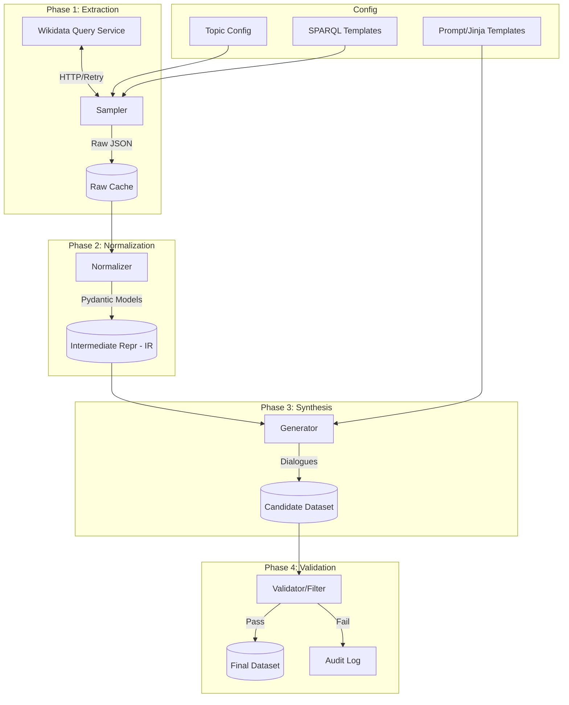

# Chapter 11：工程化实践：从脚本到生产级流水线

在前面的章节中，你可能已经用 Python 脚本跑通过几个 SPARQL 查询，并用简单的字符串替换生成了一些对话。这对于验证想法（PoC）很好，但如果你需要生产**百万级**数据、支持**每周更新**、或者需要**多人协作**，这种“手工作坊”模式很快就会崩溃。

本章将教你如何将实验代码重构为**健壮、可复现、可监控的生产级数据流水线**。

---

## 本章学习目标

1.  **工程架构**：掌握 E-T-L-E（Extract-Transform-Load-Evaluate）在数据合成中的应用。
2.  **鲁棒性设计**：处理网络抖动、API 速率限制（Rate Limiting）和断点续跑。
3.  **标准化中间层**：使用 Pydantic 定义严谨的数据 Schema（IR），解耦采集与生成。
4.  **质量保障体系**：建立“金样（Golden Set）”回归测试，防止规则修改导致的“蝴蝶效应”。
5.  **项目组织**：一个标准的数据工程项目该长什么样。

---

## 1. 理想的目录结构

在开始写代码前，先整理你的工位。一个标准化的目录结构能让你的项目清晰可维护。

```text
wikidata-dialogue-synth/
├── config/                 # 配置中心
│   ├── topic_schema.yaml   # 定义要采样的领域、权重
│   ├── queries/            # SPARQL 模板文件 (.sparql)
│   └── templates/          # 自然语言生成模板 (.jinja2 / .yaml)
├── data/                   # 数据落地（通常在 .gitignore 中忽略）
│   ├── 0_raw/              # 原始 SPARQL JSON 响应（缓存层）
│   ├── 1_intermediate/     # 清洗后的标准中间态数据 (JSONL/Parquet)
│   ├── 2_final/            # 最终生成的对话数据
│   └── goldens/            # 测试用的金样数据
├── src/                    # 源代码
│   ├── collector/          # 采样器：负责与 Wikidata 交互
│   ├── normalizer/         # 清洗器：负责脏数据处理、类型转换
│   ├── generator/          # 生成器：负责逻辑渲染、LLM 调用
│   ├── validator/          # 评估器：负责质量打分、去重
│   └── utils/              # 通用工具（日志、IO、哈希）
├── tests/                  # 单元测试与回归测试
├── scripts/                # 启动脚本 (e.g., run_pipeline.sh)
├── requirements.txt
├── Makefile                # 常用指令快捷方式
└── README.md
```

---

## 2. 流水线架构详解 (The E-T-S-V Pipeline)

我们将传统的 ETL 扩展为 **ETSV**：Extract（采集） -> Transform（规范化） -> Synthesize（合成） -> Validate（验证）。



### 2.1 阶段一：采集器 (The Sampler/Collector)

**核心挑战**：Wikidata 的 SPARQL 端点（WDQS）极其不稳定，有严格的速率限制（Rate Limit）和超时时间（60秒）。

**工程实践**：

1.  **用户代理 (User-Agent)**：必须设置。
    *   `User-Agent: MyBot/1.0 (contact@example.com) tool/data-synth`
    *   不设置会被直接封禁。
2.  **指数退避重试 (Exponential Backoff)**：
    *   不要用死循环 `while True`。推荐使用 Python 的 `tenacity` 库。
    *   策略：遇到 429 (Too Many Requests) 或 5xx 错误，等待 2s, 4s, 8s, 16s... 后重试。
3.  **分页策略**：
    *   不要试图一次拉取 `LIMIT 100000`。
    *   使用 `OFFSET` 效率很低。**最佳实践**是基于 ID 排序或时间戳切片。
4.  **幂等缓存 (Idempotent Caching)**：
    *   计算 SPARQL 查询字符串的 MD5 哈希值。
    *   在请求前，检查 `data/0_raw/{hash}.json` 是否存在。存在则直接读取。
    *   **价值**：开发调试时，你可以随意修改清洗逻辑，而无需反复轰炸 Wikidata 服务器。

**代码片段示例 (使用 Tenacity)**：

```python
import requests
from tenacity import retry, stop_after_attempt, wait_exponential, retry_if_exception_type

@retry(
    stop=stop_after_attempt(5),
    wait=wait_exponential(multiplier=1, min=2, max=60),
    retry=retry_if_exception_type((requests.exceptions.Timeout, requests.exceptions.ConnectionError))
)
def fetch_sparql(query, endpoint="https://query.wikidata.org/sparql"):
    headers = {"User-Agent": "MyDataBot/1.0 (me@example.com)"}
    response = requests.get(endpoint, params={"format": "json", "query": query}, headers=headers)
    
    if response.status_code == 429:
        raise requests.exceptions.ConnectionError("Rate Limited") # 触发重试
    
    response.raise_for_status()
    return response.json()
```

### 2.2 阶段二：规范化器 (The Normalizer)

**核心挑战**：SPARQL 返回的是极其啰嗦的 JSON（包含 xml:lang, type, value 等字段），且数据脏乱差（日期格式不一、多值、缺失）。

**工程实践**：

1.  **中间表示 (Intermediate Representation, IR)**：
    *   **切记**：不要把原始 JSON 直接传给生成器。
    *   定义一个清晰、扁平的结构。
2.  **防御性编程 (Pydantic)**：
    *   使用 `pydantic` 定义数据模型。它能在数据流入下一环节前自动校验类型。
    *   如果数据缺少关键字段（如中文名），在这里决定是**丢弃**、**回退到英文**还是**标记**。

**代码片段示例 (Pydantic Schema)**：

```python
from pydantic import BaseModel, Field, field_validator
from typing import List, Optional

class EntityIR(BaseModel):
    qid: str
    label: str
    description: Optional[str] = None
    aliases: List[str] = Field(default_factory=list)
    facts: dict = Field(default_factory=dict) # {"P569": "1893-12-26", ...}

    @field_validator('label')
    def fallback_label(cls, v, values):
        if not v:
            raise ValueError("Label is mandatory")
        return v.strip()

# 使用
# raw_item = {"item": {"value": "http://.../Q1"}, "itemLabel": {"value": "Universe"}}
# ir_obj = EntityIR(qid="Q1", label="Universe", ...)
```

### 2.3 阶段三：生成器 (The Generator)

**核心挑战**：如何保证多样性，同时保持事实准确？

**工程实践**：

1.  **模板与逻辑分离**：
    *   不要在 Python 代码里写 `f"你好，{name}"`。
    *   使用 `Jinja2` 模板引擎。这允许非程序员（如语言学家）修改话术而不动代码。
2.  **确定性随机 (Deterministic Randomness)**：
    *   **铁律**：生成器的输入相同时，输出必须完全一致。
    *   **做法**：使用 `random.Random(seed=qid_hash)`。
    *   **场景**：如果不这样做，你为了修复第 1000 条数据的错别字重跑代码，结果第 1 条数据的问法变了，导致你需要重新人工审核所有数据。
3.  **元数据注入**：
    *   生成的每一行数据，必须携带 `source_qid` 和 `provenance`（来源），便于溯源。

### 2.4 阶段四：验证与落地 (Validator & Loader)

**核心挑战**：生成了 10 万条数据，里面混进去了乱码或敏感内容怎么办？

**工程实践**：

1.  **阻塞式检查**：JSON 格式错误、必填字段缺失 -> **报错并停止**。
2.  **统计式检查**：
    *   计算**平均长度**、**词汇丰富度**。
    *   检查**重复率**（SimHash 或 MinHash）。
3.  **格式落地**：
    *   推荐 `JSONL` (JSON Lines) 用于文本数据，方便 `head` / `tail` 查看。
    *   推荐 `Parquet` 用于存储中间结构化数据（体积小，Pandas读取快）。

---

## 3. 质量保障：防止“代码腐烂”

在数据工程中，最可怕的不是代码报错，而是**代码没报错，但数据质量悄悄下降了**。

### 3.1 单元测试 (Unit Tests)
测试**函数级**逻辑。
*   `test_date_parser.py`: 输入 `+1893-00-00T00:00:00Z`，断言输出 `1893年`。
*   `test_template.py`: 输入包含特殊符号的名字 `C++ Standard`，断言模板没有崩溃或乱码。

### 3.2 黄金集回归测试 (Golden Set Regression)
这是针对生成效果最重要的测试。

1.  **选样**：挑选 50 个覆盖各类边缘情况的实体（如：没有中文名的、名字很长的、公元前的、有歧义的）。
2.  **锁定**：人工确认这 50 个实体的生成结果是完美的，存为 `tests/goldens/expected_output.jsonl`。
3.  **自动化对比**：
    *   每次 Git Push 前，脚本自动跑这 50 个实体。
    *   对比新旧输出。
    *   **Diff 报警**：如果发现差异，展示 Diff。
    *   **决策**：
        *   是意外破坏了逻辑？-> 回滚代码。
        *   是优化了模板？-> `git commit` 更新 Golden Set。

---

## 4. 版本管理与可复现性

当你发布 `v1.0` 数据集时，必须能回答：它是怎么来的？

建议在最终数据的 Header 或单独的 `manifest.json` 中记录：

```json
{
  "dataset_version": "v1.0.0",
  "created_at": "2023-10-27T10:00:00Z",
  "lineage": {
    "code_commit_sha": "a1b2c3d4e5...",
    "config_hash": "f6g7h8i9...",
    "wikidata_snapshot_date": "2023-10-20"
  },
  "stats": {
    "total_dialogues": 15420,
    "unique_entities": 5000
  }
}
```

**Rule of Thumb**：如果只有数据没有 Config 和 Commit Hash，这堆数据就是垃圾，因为它不可复现，无法迭代。

---

## 本章小结

*   **架构分层**：Sampler 负责网络，Normalizer 负责清洗（Pydantic），Generator 负责合成（Jinja2/Prompt），Validator 负责质检。
*   **断点续跑**：利用文件缓存和任务队列，避免因网络波动前功尽弃。
*   **防退化**：通过“金样回归测试”确保修改模板不会破坏现有质量。
*   **确定性**：固定随机数种子，确保流水线是幂等的可复现的。

---

## 练习题

### 基础题

<details>
<summary><strong>习题 1：编写一个健壮的文件写入器</strong></summary>

**题目**：
在数据处理中，如果程序写文件写到一半崩溃，会留下损坏的文件。
请编写一个函数 `safe_write_jsonl(data, filename)`，要求：
1. 先写入临时文件 `filename.tmp`。
2. 写入完成后，再重命名为 `filename`（原子操作）。
3. 包含异常处理。

**提示**：使用 `os.replace` (Windows/Linux 兼容的原子移动)。

<details>
<summary><strong>参考答案</strong></summary>

```python
import json
import os
import shutil

def safe_write_jsonl(data: list, filename: str):
    temp_filename = f"{filename}.tmp"
    try:
        with open(temp_filename, 'w', encoding='utf-8') as f:
            for entry in data:
                f.write(json.dumps(entry, ensure_ascii=False) + '\n')
        
        # 原子替换：要么成功，要么文件不存在，不会出现写一半的文件
        os.replace(temp_filename, filename)
        print(f"Successfully wrote to {filename}")
        
    except Exception as e:
        print(f"Failed to write file: {e}")
        if os.path.exists(temp_filename):
            os.remove(temp_filename) # 清理垃圾
        raise
```
</details>
</details>

<details>
<summary><strong>习题 2：Pydantic 校验练习</strong></summary>

**题目**：
定义一个 Pydantic 模型 `ConversationTurn`，要求：
1. `role`: 只能是 "user" 或 "bot"。
2. `content`: 字符串，长度必须大于 2。
3. `confidence`: 浮点数，0.0 到 1.0 之间，默认 1.0。

<details>
<summary><strong>参考答案</strong></summary>

```python
from pydantic import BaseModel, field_validator, Field
from typing import Literal

class ConversationTurn(BaseModel):
    role: Literal["user", "bot"]
    content: str = Field(min_length=3) # 长度>2，即最小3
    confidence: float = Field(default=1.0, ge=0.0, le=1.0)

# 测试
# t = ConversationTurn(role="user", content="hi", confidence=0.9) # 报错：content太短
# t = ConversationTurn(role="system", content="hello") # 报错：role 不合法
```
</details>
</details>

### 挑战题

<details>
<summary><strong>习题 3：设计一个基于文件哈希的断点续跑器</strong></summary>

**题目**：
你需要处理 100 个大任务（task_id: 1~100）。
请设计一个简单的 TaskManager 类：
1. 接受一个任务列表。
2. 检查 output 目录下是否已经存在 `result_{task_id}.json`。
3. 如果存在且文件完整（这里简单判断文件不为空），跳过该任务。
4. 提供一个进度条（使用 `tqdm`）。

**提示**：利用 Python 的 `pathlib` 和 `tqdm`。

<details>
<summary><strong>参考答案</strong></summary>

```python
import os
from tqdm import tqdm
import time

class TaskManager:
    def __init__(self, output_dir):
        self.output_dir = output_dir
        os.makedirs(output_dir, exist_ok=True)

    def process_tasks(self, task_ids, process_func):
        # 1. 过滤已完成的任务
        todos = []
        for tid in task_ids:
            outfile = os.path.join(self.output_dir, f"result_{tid}.json")
            # 简单检查：文件存在且大小>0
            if os.path.exists(outfile) and os.path.getsize(outfile) > 0:
                continue
            todos.append(tid)

        print(f"Skipped {len(task_ids) - len(todos)} tasks. Processing {len(todos)} tasks...")

        # 2. 处理剩余任务
        for tid in tqdm(todos):
            try:
                result = process_func(tid)
                # 写入结果
                outfile = os.path.join(self.output_dir, f"result_{tid}.json")
                with open(outfile, 'w') as f:
                    f.write(str(result)) # 简化写入
            except Exception as e:
                print(f"Task {tid} failed: {e}")

# 模拟处理函数
def mock_worker(tid):
    time.sleep(0.1)
    return {"id": tid, "status": "done"}

# 运行
mgr = TaskManager("./output_buffer")
mgr.process_tasks(range(100), mock_worker)
```
</details>
</details>

---

## 常见陷阱与错误 (Gotchas)

### 1. 内存溢出 (OOM)
*   **错误做法**：`all_data = []`，然后在循环里把 100 万条数据 append 进去，最后一次性 write。
*   **后果**：跑到 80% 时内存爆了，程序被 Kill，所有数据丢失。
*   **修正**：使用**流式处理**（Generator/Iterator）。每处理一条（或一个 Batch），就 yield 出来写入文件。

### 2. 多进程的文件锁冲突
*   **错误做法**：开启 8 个进程并行处理，结果它们试图同时写入同一个 `output.jsonl` 文件。
*   **后果**：文件内容交错乱码，JSON 格式损坏。
*   **修正**：
    *   方案 A：每个进程写自己的文件 `part_1.jsonl`, `part_2.jsonl`，最后合并。
    *   方案 B：使用主进程负责写（Receiver），子进程只负责处理并通过 Queue 发送结果。

### 3. 时间与时区的泥潭
*   **错误做法**：在代码里假设 `date` 都是 "YYYY-MM-DD"。
*   **现实**：Wikidata 有 "18世纪" (precision=8), "2020s" (precision=8), "公元前200年"。
*   **修正**：必须检查 Wikidata 时间值的 `precision` 字段。不要盲目转化为 Python `datetime` 对象，有时保留原始字符串更安全。

---

[< Chapter 10：许可与合规](chapter10.md) | [Appendices：查询模板库与速查表 >](chapter12.md)
