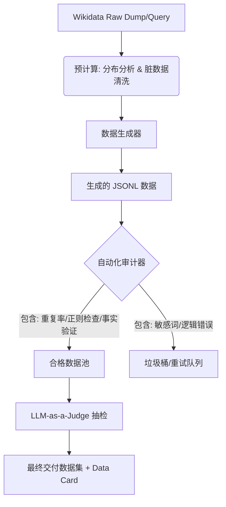

# Chapter 8：质量控制与评估体系：构建数据流水线的“质检局”

> **“数据生成的门槛很低，但高质量数据的门槛极高。”**

在前面的章节中，你已经掌握了如何“生产”数据。现在的挑战是：当你的一键脚本运行了一整晚，生成了 50 万条对话数据后，你如何向你的团队或用户证明这批数据是可用的？

如果数据中充斥着“奥巴马是现任总统”（时效性错误）、90% 都在谈论“复仇者联盟”（覆盖率失衡）或者每句话都像机器人（语言僵硬），那么这批数据对于训练模型不仅无益，反而有害。

本章将教你搭建一套完整的 **QA（Quality Assurance）Pipeline**，涵盖从宏观分布到微观事实的各个层面。

---

## 1. 质量评估流水线概览

我们建议将质量控制分为三个阶段（Stages）：

1.  **预计算阶段 (Pre-Computation Analysis)**：在生成对话文本之前，先对采样的**知识图谱子图（KG Subgraph）**进行体检。
2.  **后处理阶段 (Post-Generation Audit)**：对生成的自然语言文本进行自动化指标计算。
3.  **人工/模型抽检 (Human/LLM-in-the-loop)**：利用少量样本进行深度语义评估。



---

## 2. 维度一：宏观覆盖率与多样性 (Coverage & Diversity)

多样性不仅仅是“不一样”，而是“符合预期的分布”。

### 2.1 分布偏斜度 (Distribution Skewness)

不要只看总数，要看**基尼系数**或**头部占比**。

**关键指标：**
- **Top-K 占比 (Top-K Ratio)**：出现频率最高的 10 个实体/关系占总数据的比例。
  - *目标*：Top-10 < 5%（除非是专门针对某热门领域的微调数据）。
- **领域熵 (Entropy of Domains)**：
  - 将数据映射到大类（Q5人物, Q515城市, Q11424电影...）。计算类别的熵值。熵越高，类别分布越均匀。

### 2.2 盲区检测 (Blind Spot Detection)

Wikidata 存在严重的“西方中心主义”和“近代中心主义”。你需要显式地定义**Bucket（桶）**来监控采样：

| Bucket 维度 | 监控逻辑 (Rule-of-Thumb) | 常见失衡现象 | 修正策略 |
| :--- | :--- | :--- | :--- |
| **地域 (Geo)** | 统计 `P17` (国家) 的所属大洲。 | 欧美占 80%，非洲/南美 < 1%。 | 强制采样：对非欧美地区的 QID 进行加权采样（Up-sampling）。 |
| **时间 (Time)** | 统计 `P580/P585` 的年代。 | 21世纪占 90%，古代史缺失。 | 分层采样：设立 `Antiquity`, `Middle Ages`, `Modern` 时间桶。 |
| **流行度 (Pop)** | 统计 `sitelinks` 数量。 | 全是维基百科有词条的名人。 | 引入 `sitelinks=0` 但有丰富声明（statements > 10）的长尾实体。 |

### 2.3 属性多样性 (Predicate Diversity)

对话不应只聊 `P569` (出生日期) 和 `P19` (出生地)。
- **指标**：**Unique Predicates per 1k Dialogues**。
- **动作**：检查直方图。如果 `P17` (国家) 出现了 10000 次，而 `P166` (获奖) 只出现 5 次，你需要调整你的模板选择概率。

---

## 3. 维度二：微观重复率 (Micro-level Repetition)

重复是合成数据的大敌，会导致模型训练过拟合（Overfitting）。

### 3.1 文本级重复 (N-gram Repetition)

使用 NLP 经典指标来衡量生成的“语言丰富度”：

- **Distinct-N (D-1, D-2)**：
  $$ \text{Distinct-N} = \frac{\text{Count(Unique N-grams)}}{\text{Count(Total N-grams)}} $$
  - *解读*：D-2 低于 0.4 通常意味着严重的模板重复。
- **Self-BLEU**：
  从数据集中随机抽取一条作为 Hypothesis，其余作为 References 计算 BLEU。分数越低越好（说明每条句子都长得不一样）。

### 3.2 语义级重复 (Semantic Collision)

有些句子虽然字不一样，但意思是完全重复的。

- **Jaccard 相似度去重**：
  - 句子 A：“乔布斯是苹果的创办人。”
  - 句子 B：“苹果公司是由乔布斯创立的。”
  - *策略*：对于同一对 (Entity, Attribute)，如果生成了多条数据，计算它们的 Jaccard Similarity。如果 > 0.8，丢弃其中一条。

### 3.3 模板复用率监控

如果你有 100 个模板，但脚本因为某些逻辑 bug 只用到了前 5 个，数据会极其单调。
- **审计方法**：在生成日志中记录 `template_id`。绘制模板使用热力图，确保长尾模板也被调用。

---

## 4. 维度三：事实一致性 (Factual Consistency) —— 核心难点

这是 Wikidata 数据的生命线。我们需要构建一个 **Fact Validator (事实校验器)**。

### 4.1 深度时效性校验 (Temporal Validity)

最容易出错的是“前任”与“现任”的混淆。

**校验逻辑伪代码：**
```python
def check_temporal_validity(statement, current_year=2024):
    """
    判断一个事实在当下是否依然为真
    """
    start_time = statement.get_qualifier('P580') # start time
    end_time = statement.get_qualifier('P582')   # end time
    
    # 情况 1: 已经结束的事实
    if end_time and parse_year(end_time) < current_year:
        return "PAST" # 应该是 "曾任" / "前"
        
    # 情况 2: 未来才开始的事实 (例如预定的奥运会)
    if start_time and parse_year(start_time) > current_year:
        return "FUTURE" # 应该是 "将担任" / "计划于"
        
    # 情况 3: 正在进行
    return "PRESENT" # 应该是 "是" / "现任"
```

**Rule-of-Thumb**:
- 生成文本中如果包含“**是**”、“**现任**”、“**正在**”，但三元组有 `P582` (end time)，标记为 **Error**。
- 生成文本中如果包含“**曾**”、“**前**”，但三元组没有 `P582` 且有 `P580`，标记为 **Warning** (可能是现任，也可能只是数据缺失)。

### 4.2 唯一性冲突 (Uniqueness Violation)

某些属性在常识中是“单值”的，但在 Wikidata 中可能有多个值（历史遗留或争议）。

- **例子**：`P1376` (capital of)。中国历史上有多个首都。
- **校验**：对于单值语义的属性（如出生地、生父、死亡日期），如果 API 返回了列表长度 > 1，**必须**检查限定符，否则极易生成“某人死于1990年和1991年”的胡话。

### 4.3 数值与单位归一化 (Value & Unit Normalization)

Wikidata 的数值往往带有单位 QID（如 Q4917 米, Q21857 英尺）。

- **陷阱**：建筑高度。有些条目是米，有些是英尺。
- **审计**：建立一个 `Unit Converter`。
  - *错误*：Eiffel Tower height is 1063 (Raw value, actually feet).
  - *修正*：检测到单位是 feet -> 转换为 324 meters -> 生成文本 "324米"。
  - *自动检查*：提取生成文本中的数字，与 Wikidata raw value 进行量纲比对。

---

## 5. 维度四：自然度与幻觉 (Naturalness & Hallucination)

### 5.1 拒绝“百科腔” (Wikipedia Style)

对话数据需要口语化。

- **检测特征**：
  - 过长的定语从句。
  - 括号注释过多：如 "北京（中国的首都）"。
  - 书面连接词：“然而”、“故此”、“综上所述”。
- **评分**：使用 Perplexity (PPL) 或简单的规则过滤器，剔除过于书面化的句子。

### 5.2 幻觉检测 (Hallucination Check)

当模板中的槽位（Slot）未被正确填充，或者填充了错误的实体标签时。

- **标签回退导致的幻觉**：
  - 英文标签：`Q123 -> "Big Bank (defunct)"`
  - 粗暴翻译/回退：生成文本“**大银行（倒闭）**位于纽约。”
  - *问题*：括号里的内容不应直接读出来。
  - *修正*：预处理清洗 Label，去除括号、消歧义后缀。

---

## 6. 进阶：LLM-as-a-Judge (用大模型评分)

对于复杂的逻辑和流畅度，规则很难判断。当前业界的做法是采样 1% 的数据，送给 GPT-4 或 Qwen-Max 进行打分。

### 6.1 提示词模板 (Prompt Template)

```markdown
你是一个严格的数据质量审计员。请评估以下基于知识库生成的对话数据。

**输入数据：**
- 知识三元组：{Subject: 埃隆·马斯克, Predicate: CEO of, Object: Tesla, Start: 2008}
- 生成对话：
  A: "你知道谁是特斯拉的老板吗？"
  B: "当然，埃隆·马斯克从2008年开始就一直担任特斯拉的CEO。"

**评估维度（1-5分）：**
1. **事实一致性**：对话是否准确反映了三元组信息？有没有编造？
2. **自然度**：对话是否像人类的日常闲聊？
3. **逻辑性**：问答逻辑是否连贯？

**输出格式：**
JSON: {"consistency": 5, "naturalness": 4, "logic": 5, "reason": "..."}
```

### 6.2 审计报告

根据 LLM 的打分，生成 **Pass Rate**。如果自然度平均分 < 3.5，说明模板库需要重写。

---

## 7. 本章小结

质量控制不是生成后的“补救”，而是贯穿全流程的“工程”。

1.  **Macro（宏观）**：用 Bucket 和 Gini 系数监控覆盖率，拒绝数据偏见。
2.  **Micro（微观）**：用 Distinct-N 和 Jaccard 监控重复率，拒绝复读机。
3.  **Truth（真相）**：用时间逻辑和单位换算器构建 Validator，拒绝事实错误。
4.  **Audit（审计）**：引入 LLM-as-a-Judge 进行最终把关。

---

## 8. 练习题

### 基础题

#### 练习 1：编写一个简单的“时间冲突”检测器
**场景**：你生成了一句话“迈克尔·杰克逊现在住在洛杉矶。”
**已知事实**：`Michael Jackson (Q2808)` -> `date of death (P570)` -> `2009-06-25`.
**任务**：写一段 Python 伪代码，输入是 (Entity_Dict, Generated_Text)，如果检测到死者使用了“现在/正在”等存活状态词，返回 False。

<details>
<summary>点击展开答案</summary>

```python
def check_alive_status(entity_data, text):
    # 1. 检查实体是否有死亡日期
    death_date = entity_data.get('claims', {}).get('P570')
    is_dead = death_date is not None
    
    # 2. 定义“存活状态”的敏感词
    alive_keywords = ["现在", "正在", "现任", "目前", "living in", "is a"]
    
    # 3. 冲突检测
    if is_dead:
        for word in alive_keywords:
            if word in text:
                return False, f"Error: Entity is dead (died {death_date}), but text implies alive using '{word}'."
    
    return True, "OK"
```
**提示**：实际工程中，还需要考虑“过去时”的表达（如“他生前住在...”）是允许的，所以需要依赖句法分析或更严格的模板匹配。
</details>

#### 练习 2：计算 Distinct-2 指标
给定以下三句话，计算 Distinct-2 (Bigram) 的比率。
1. "北京是中国的首都"
2. "东京是日本的首都"
3. "巴黎是法国的首都"
*(假设分词后为：北京/是/中国/的/首都)*

<details>
<summary>点击展开答案</summary>

**分词序列**：
1. `[北京, 是, 中国, 的, 首都]` -> Bigrams: `(北京,是), (是,中国), (中国,的), (的,首都)`
2. `[东京, 是, 日本, 的, 首都]` -> Bigrams: `(东京,是), (是,日本), (日本,的), (的,首都)`
3. `[巴黎, 是, 法国, 的, 首都]` -> Bigrams: `(巴黎,是), (是,法国), (法国,的), (的,首都)`

**统计**：
- Total Bigrams = 4 + 4 + 4 = 12
- Unique Bigrams:
  - 重复的: `(的,首都)` 出现3次 (计为1个unique)
  - 其它的: `(北京,是)...` 等9个各不相同
  - Unique count = 9 + 1 = 10 ? 
  - 实际上：`(北京,是), (是,中国), (中国,的), (的,首都), (东京,是), (是,日本), (日本,的), (巴黎,是), (是,法国), (法国,的)`
  - 其中 `(的,首都)` 是共用的。
  - Unique Bigrams Set Size = 10.

**计算**：
Distinct-2 = 10 / 12 ≈ 0.83

**结论**：这个分数看起来很高，但这是因为实体名不同。如果你把实体名都 mask 成 `<LOC>`, 句子变成 `<LOC>是<LOC>的首都`，重复率就是 100%。**这也是为什么评估模板多样性时，建议先 Mask 掉实体词再计算。**
</details>

---

### 挑战题

#### 挑战 1：设计“多值消歧”策略
**背景**：属性 `P161` (cast member/演员表) 对于电影《复仇者联盟》有几十个值。
**问题**：如果在对话中列举所有演员，句子会过长且不自然。如果只随机选一个，用户可能会觉得“为什么不说钢铁侠？”。
**任务**：设计一个算法，基于 Wikidata 的数据特征，选择“最重要”的 3 个演员。

<details>
<summary>点击展开提示</summary>

**Hint**:
Wikidata 的 `statement` 列表本身不保证顺序。你需要引入外部辅助数据或内部隐含特征。
1. 检查 `P161` 是否有 Qualifier `P39` (character role) 或 `P453` (character role)。这不一定能解决“主角”问题。
2. **利用 Sitelinks**: 演员本身的知名度（Sitelinks 数量）通常与他们在电影中的重要性正相关。
3. **利用 Image**: 有头像图片的演员通常比没有的更重要。
</details>

<details>
<summary>点击展开答案</summary>

**推荐算法**：
1. 获取电影的所有 `P161` 目标实体（演员 QIDs）。
2. 对每个演员 QID，查询其 `wikibase:sitelinks` 计数。
3. 按 Sitelinks 降序排列。
4. 取 Top-3。
   
**逻辑**：小罗伯特·唐尼（Iron Man）的词条链接数肯定远多于某个龙套演员。这种基于**PageRank 思想**的排序在知识图谱中非常有效。
</details>

#### 挑战 2：构建“反事实”负样本 (Negative Sampling)
为了训练模型不仅知道“什么是对的”，还要知道“什么是错的”，你需要特意生成一些错误的对话作为负样本（用于训练 Reward Model 或判别器）。
**任务**：基于正确三元组 `(奥巴马, 出生于, 檀香山)`，设计三种不同类型的“错误生成策略”。

<details>
<summary>点击展开答案</summary>

**策略 1：实体替换 (Entity Swap)**
- 保持关系不变，替换 Object 为同类型的其他实体。
- 生成：“奥巴马出生于**纽约**。” (选取一个热门的错误城市)

**策略 2：关系错误 (Relation Error)**
- 保持实体不变，替换 Predicate。
- 生成：“奥巴马**逝世于**檀香山。” (将 P19 出生地 替换为 P20 死亡地)

**策略 3：时序错乱 (Temporal Glitch)**
- 针对有时间限定符的事实，修改时间。
- 生成：“奥巴马**在1860年**出生于檀香山。”

**用途**：这类数据对于训练模型的“幻觉检测”能力极具价值。
</details>

---

## 9. 常见陷阱与错误 (Gotchas)

| 陷阱 | 现象 | 调试/解决方法 |
| :--- | :--- | :--- |
| **"The Unknown"** | 某些值是 "unknown value" (Wikidata 里的特殊节点)，脚本将其当做普通 QID 处理。 | 检查 `snaktype`。如果不是 `value` 而是 `somevalue` 或 `novalue`，生成的文本应为“具体不详”而不是报错或乱码。 |
| **坐标系的灾难** | `P625` (Coordinate) 返回的是 JSON `{'latitude': ..., 'longitude': ...}`，直接转字符串会很难看。 | 需要专门的 Geo-Template，将坐标转换为“位于北纬X度”或者结合 `P17` 说“位于某国”。 |
| **多语言混合列表** | 生成列表时："苹果、Banana、Orange"。 | 检查 Label 的 `language` 字段。如果中文缺失，宁可丢弃该项，也不要中英混杂（除非你的设定允许）。 |
| **递归死循环** | 在追踪 `subclass of` (P279) 寻找父类时，数据中存在环路 (A is sub of B, B is sub of A)。 | 设置最大递归深度（Max Depth = 5），防止脚本挂死。 |
| **JSONL 格式逃逸** | 生成的文本中包含换行符 `\n` 或双引号 `"`，破坏了 JSONL 结构。 | 务必使用 `json.dumps()` 进行序列化，严禁手动字符串拼接 `"{...}"`。 |

---

[< Chapter 7：中文自然语言生成](chapter7.md) | [Chapter 9：多语言与中文缺失处理 >](chapter9.md)
